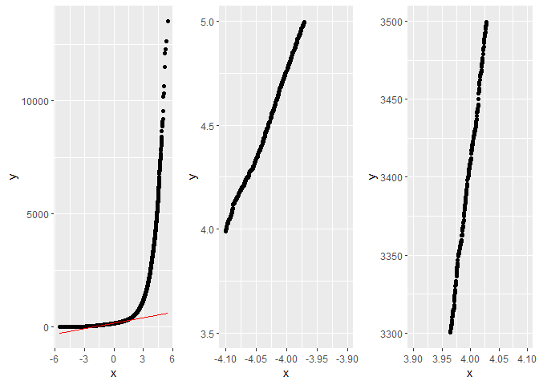

A Simple Illustration of the Most Probable Point
================

 
A Simple Illustration of the Most Probable Point, and an example use case to calculate the quantile of an output function. 

Source files to knit the R-markdown is in the [`RMD`](RMD/) folder. The knitted html is [here](http://htmlpreview.github.io/?https://github.com/hpandana/most-probable-point/blob/main/RMD/mpp.html).

The following is a trimmed-down version of the RMD for display purpuse in github. Please see [this](http://htmlpreview.github.io/?https://github.com/hpandana/most-probable-point/blob/main/RMD/mpp.html)  for the complete version.

Despite criticisms and called by different names, Most Probable Point
(MPP) is a fascinating concept, arisen from the field of structural
reliability. Other names include Most Probable Failure Point, Most
Central Limit-state Point, Most Central Failure Point, Design Point. The
last one is deemed the most satisfactory. Nevertheless, we call it MPP
in this markdown.

In structural reliability, a performance function
")
characterizes the response of the system: with a negative value
indicating failure and a positive value implying that the system is
safe. The border between the negative and positive domains is called the
limit state:
=0").
Reliability concerns with the probability of not failing, ie. the
complement of the probability of failure
:
.

The most common method to calculate the probability of failure is the
Monte Carlo simulation. However, the required number of samples
increases drastically when
 is getting small.
MPP provides an approximation to
, with computation
cost that does not depend on the magnitude of
, because finding
MPP is an optimization problem.

Hasofer-Lind prescribed a procedure to obtain the MPP:

1.  Transform all of the input random variables from the physical space
    into uncorrelated standardized normal random variables.
2.  Find the MPP. The distance from the origin to the MPP in the
    standardized uncorrelated space is called the Hasofer-Lind index
    ,
    also called the reliability index.

With First Order Reliability Method (FORM) approximation of the limit
state, the probability of failure
<0)")
is given by
"),
where  is
the cumulative distribution function (CDF) of the standard normal
distribution.

In a very restrictive case, if the performance function
")is
linear, and therefore the limit state
=0")
is a hyper-plane, then the probability of failure
 is given exactly
by
"),
where  is
the distance  from the
origin

to MPP

on the hyper-plane of the linear limit-state function
=0")
in the uncorrelated standardized normally distributed input space. In
more relaxed cases, when the performance function is non-linear, or even
when the performance function is linear, transformation of input
variables can result in non-linear limit-state function,
")
becomes only an approximation to
.

Since  is simply a
CDF, which is (approximately)
"),
and since  is the
*length* of the hyper-sphere of the standardized input random variables
,
another subtle use case of MPP is that we can find the quantile of the
output function  by
calculating
").
For example, if we want to find the output quantile at 4-sigma (ie.
")),
we can find the MPP point

on the
")
hyper-plane that coincides with the hyper-sphere of the standardized
input random variables, then the output quantile at 4-sigma is
").
The example given in the last section is solving output quantile instead
of calculating .

# Example

We picked a 2D input example for easy visualization. Consider a
non-linear performance function with 2D inputs, one being log-normally
distributed and a second one being normally distributed, with a known
correlation coefficient among the two:
 = (x_1+x_2)^2+3(-x_1+x_2)^2"),
with
"),
"),
and

= 0.65. Find the

quantile of  using MPP
and verify it with Monte Carlo simulations.

The first step of the Hasofer-Lind procedure is to express
")
as
")
with ,
 being
uncorrelated normally distributed inputs.

1.  We starts backward from
    "),
    and
    ").
2.  Correlate
    
    to get
    ,
    with
    
    still being normally distributed
    "),
    using yet to be determined
    :

    

    
3.  Scale and shift
    
    to get
    ,
    with
    "),
    and
    "):

    

    
4.  Transform normal into lognormal:

    
    ")

    

Given
"),
we can calculate its mean and variance:

 = \exp (1.5 + 0.5^2/2 ) = 5.078419
")

![
\\sigma\_{X_1}^2 = \\left\[\\exp(\\sigma^2)-1\\right\] \\exp(2\\mu+\\sigma^2) 
](https://latex.codecogs.com/png.latex?%0A%5Csigma_%7BX_1%7D%5E2%20%3D%20%5Cleft%5B%5Cexp%28%5Csigma%5E2%29-1%5Cright%5D%20%5Cexp%282%5Cmu%2B%5Csigma%5E2%29%20%0A "
\sigma_{X_1}^2 = \left[\exp(\sigma^2)-1\right] \exp(2\mu+\sigma^2) 
")

![
\\sigma\_{X_1}^2 = \\left\[\\exp(0.5^2)-1\\right\] \\exp(2 \\times 1.5 + 0.5^2) = 7.325112
](https://latex.codecogs.com/png.latex?%0A%5Csigma_%7BX_1%7D%5E2%20%3D%20%5Cleft%5B%5Cexp%280.5%5E2%29-1%5Cright%5D%20%5Cexp%282%20%5Ctimes%201.5%20%2B%200.5%5E2%29%20%3D%207.325112%0A "
\sigma_{X_1}^2 = \left[\exp(0.5^2)-1\right] \exp(2 \times 1.5 + 0.5^2) = 7.325112
")

Using the semi-empirical equations provided in Kiureghian and Liu 1986:


=\frac{\delta_{X_1}}{\sqrt{\ln(1+\delta_{X_1}^2)}}=\frac{0.5329404}{\sqrt{\ln(1+0.5329404^2)}}=1.065881
")

Then, we can calculate

to be substituted into step 2 above:


Following step 1 to 4 outlined above,
 becomes:

= (x_1+x_2)^2+3(-x_1+x_2)^2
")

= (\exp(v_1)+v_2)^2+3(-\exp(v_1)+v_2)^2
")

= (\exp(0.5 z_1 + 1.5)+(1.5 z_2 + 7))^2 + ...
")

+(1.5 z_2 + 7))^2
")

= (\exp(0.5 u_1 + 1.5)+(1.5 (0.6928225 u_1 + 0.7211082 u_2) + 7))^2+...
")

+(1.5 (0.6928225 u_1 + 0.7211082 u_2) + 7))^2
")

The second step of the Hasofer-Lind procedure is to find MPP. The
following code shows a crude iterative method to find the MPP point on
the 4-sigma hyper-sphere of the
")
inputs, such that the vector of origin

to MPP

is parallel (for
,
or anti-parallel for
)
with the gradient at the MPP
").

We can calculate
")
by hand:

![
\\nabla G(u_1, u_2) = \\hat{u_1} \\{ 2 \[\\exp (0.5u_1+1.5) + 1.5(\\rho_0 u_1 + \\sqrt{1-\\rho_0^2} u_2) + 7\] \\times ...
](https://latex.codecogs.com/png.latex?%0A%5Cnabla%20G%28u_1%2C%20u_2%29%20%3D%20%5Chat%7Bu_1%7D%20%5C%7B%202%20%5B%5Cexp%20%280.5u_1%2B1.5%29%20%2B%201.5%28%5Crho_0%20u_1%20%2B%20%5Csqrt%7B1-%5Crho_0%5E2%7D%20u_2%29%20%2B%207%5D%20%5Ctimes%20...%0A "
\nabla G(u_1, u_2) = \hat{u_1} \{ 2 [\exp (0.5u_1+1.5) + 1.5(\rho_0 u_1 + \sqrt{1-\rho_0^2} u_2) + 7] \times ...
")

![
\\times \[0.5 \\exp (0.5u_1+1.5) + 1.5 \\rho_0\]  + ...
](https://latex.codecogs.com/png.latex?%0A%5Ctimes%20%5B0.5%20%5Cexp%20%280.5u_1%2B1.5%29%20%2B%201.5%20%5Crho_0%5D%20%20%2B%20...%0A "
\times [0.5 \exp (0.5u_1+1.5) + 1.5 \rho_0]  + ...
")

![
+6 \[-\\exp (0.5u_1+1.5) + 1.5(\\rho_0 u_1 + \\sqrt{1-\\rho_0^2} u_2) + 7\] \\times ...
](https://latex.codecogs.com/png.latex?%0A%2B6%20%5B-%5Cexp%20%280.5u_1%2B1.5%29%20%2B%201.5%28%5Crho_0%20u_1%20%2B%20%5Csqrt%7B1-%5Crho_0%5E2%7D%20u_2%29%20%2B%207%5D%20%5Ctimes%20...%0A "
+6 [-\exp (0.5u_1+1.5) + 1.5(\rho_0 u_1 + \sqrt{1-\rho_0^2} u_2) + 7] \times ...
")

![
\\times \[-0.5 \\exp (0.5u_1+1.5) + 1.5 \\rho_0\] \\} +...
](https://latex.codecogs.com/png.latex?%0A%5Ctimes%20%5B-0.5%20%5Cexp%20%280.5u_1%2B1.5%29%20%2B%201.5%20%5Crho_0%5D%20%5C%7D%20%2B...%0A "
\times [-0.5 \exp (0.5u_1+1.5) + 1.5 \rho_0] \} +...
")

![
+\\hat{u_2} \\{  2 \[\\exp (0.5u_1+1.5) + 1.5(\\rho_0 u_1 + \\sqrt{1-\\rho_0^2} u_2) + 7\] \\times ...
](https://latex.codecogs.com/png.latex?%0A%2B%5Chat%7Bu_2%7D%20%5C%7B%20%202%20%5B%5Cexp%20%280.5u_1%2B1.5%29%20%2B%201.5%28%5Crho_0%20u_1%20%2B%20%5Csqrt%7B1-%5Crho_0%5E2%7D%20u_2%29%20%2B%207%5D%20%5Ctimes%20...%0A "
+\hat{u_2} \{  2 [\exp (0.5u_1+1.5) + 1.5(\rho_0 u_1 + \sqrt{1-\rho_0^2} u_2) + 7] \times ...
")

![
\\times \[1.5 \\sqrt{1-\\rho_0^2} \]  + ...
](https://latex.codecogs.com/png.latex?%0A%5Ctimes%20%5B1.5%20%5Csqrt%7B1-%5Crho_0%5E2%7D%20%5D%20%20%2B%20...%0A "
\times [1.5 \sqrt{1-\rho_0^2} ]  + ...
")

![
+6 \[-\\exp (0.5u_1+1.5) + 1.5(\\rho_0 u_1 + \\sqrt{1-\\rho_0^2} u_2) + 7\] \\times \[1.5 \\sqrt{1-\\rho_0^2} \] \\}
](https://latex.codecogs.com/png.latex?%0A%2B6%20%5B-%5Cexp%20%280.5u_1%2B1.5%29%20%2B%201.5%28%5Crho_0%20u_1%20%2B%20%5Csqrt%7B1-%5Crho_0%5E2%7D%20u_2%29%20%2B%207%5D%20%5Ctimes%20%5B1.5%20%5Csqrt%7B1-%5Crho_0%5E2%7D%20%5D%20%5C%7D%0A "
+6 [-\exp (0.5u_1+1.5) + 1.5(\rho_0 u_1 + \sqrt{1-\rho_0^2} u_2) + 7] \times [1.5 \sqrt{1-\rho_0^2} ] \}
")

Let us calculate
 for
the log-normal 
variable:

``` r
#lognormal:  m1=1.5, s1=0.5
m1= 1.5; s1= 0.5

m_x1= exp(m1 + 0.5*s1^2)
var_x1= (exp(s1^2)-1)*exp(2*m1+s1^2)
delta_x1= sqrt(var_x1)/m_x1
f_x1= delta_x1/sqrt(log(1+delta_x1^2))

rho= 0.65
rho_0= f_x1* rho
print (rho_0)
```

    ## [1] 0.6928225

We will setup the functions to calculate
")
and
").

``` r
# calculate L2-norm
f_norm <- function(x) {
  return ( ((x %*% x)[1, 1])^0.5 )
}
# g
f_g <- function(u) {
  u1= u[1]
  u2= u[2]
  return ( (exp(0.5*u1+1.5) + (1.5*(rho_0*u1+sqrt(1-rho_0^2)*u2)+7))^2 + 3*(-exp(0.5*u1+1.5) + (1.5*(rho_0*u1+sqrt(1-rho_0^2)*u2)+7))^2 )
}
# dg returns the u1 and u2 components of the gradient g
f_dg <- function(u) {
  u1= u[1]
  u2= u[2]
  return (c(
    (2*(exp(0.5*u1+1.5) + (1.5*(rho_0*u1+sqrt(1-rho_0^2)*u2)+7))*(0.5*exp(0.5*u1+1.5)+1.5*rho_0) + 6*(-exp(0.5*u1+1.5) + (1.5*(rho_0*u1+sqrt(1-rho_0^2)*u2)+7))*(-0.5*exp(0.5*u1+1.5)+1.5*rho_0)) ,
    (2*(exp(0.5*u1+1.5) + (1.5*(rho_0*u1+sqrt(1-rho_0^2)*u2)+7))*(1.5*sqrt(1-rho_0^2)) + 6*(-exp(0.5*u1+1.5) + (1.5*(rho_0*u1+sqrt(1-rho_0^2)*u2)+7))*(1.5*sqrt(1-rho_0^2)) )) )
}
```

Finding

MPP point:

``` r
r= 4
# u1 and u2 are initial guess of points along the 4sigma circle
u1= 4
u2= 0
u_ = c(u1,u2)
for (i in 1:10) {

  g= f_g(u_)
  dg_ = f_dg(u_)
  
  dot= ((u_/r) %*% (dg_/f_norm(dg_) ) )[1,1]
  print (c(u_, g, dot))
  
  #un are new points
  #There are two MPP i.e. at +/-4sigma, we run this algorithm at +/- the gradient
  #un = u_/r +/- dg_/f_norm(dg_)
  un = u_/r + dg_/f_norm(dg_)
  u_ = un/f_norm(un) * r
}
```

    ## [1]    4.0000000    0.0000000 3406.5736598    0.9999159
    ## [1]    3.99991587   -0.02594262 3407.48601719    0.99997857
    ## [1]    3.99980952   -0.03903605 3407.71848632    0.99999454
    ## [1]    3.99973957   -0.04564397 3407.77770205    0.99999861
    ## [1]    3.99970012   -0.04897873 3407.79278408    0.99999965
    ## [1]    3.99967916   -0.05066164 3407.79662523    0.99999991
    ## [1]    3.99966831   -0.05151093 3407.79760350    0.99999998
    ## [1]    3.99966277   -0.05193952 3407.79785264    0.99999999
    ## [1]    3.99965996   -0.05215581 3407.79791608    1.00000000
    ## [1]    3.99965853   -0.05226496 3407.79793224    1.00000000

From the code chunk above, the MPP point for

is
 = (3.99965853, -0.05226496)"),
and
= 3407.79793224").

Finding

MPP point:

``` r
r= 4
# u1 and u2 are initial guess of points along the 4sigma circle
u1= 4
u2= 0
u_ = c(u1,u2)
for (i in 1:10) {

  g= f_g(u_)
  dg_ = f_dg(u_)
  
  dot= ((u_/r) %*% (dg_/f_norm(dg_) ) )[1,1]
  print (c(u_, g, dot))
  
  #un are new points
  #There are two MPP i.e. at +/-4sigma, we run this algorithm at +/- the gradient
  #un = u_/r +/- dg_/f_norm(dg_)
  un = u_/r - dg_/f_norm(dg_)
  u_ = un/f_norm(un) * r
}
```

    ## [1]    4.0000000    0.0000000 3406.5736598    0.9999159
    ## [1]   0.02594262   3.99991587 391.87421829   0.82363021
    ## [1] -3.8117762  1.2125850 65.8802208 -0.3835513
    ## [1] -3.8435730 -1.1076763 10.0469124 -0.8515261
    ## [1] -3.3963520 -2.1130057  4.4191063 -0.9812408
    ## [1] -3.1757451 -2.4320039  4.0103315 -0.9995167
    ## [1] -3.1375572 -2.4810753  4.0016311 -0.9999968
    ## [1] -3.134428 -2.485027  4.001576 -1.000000
    ## [1] -3.134211 -2.485301  4.001575 -1.000000
    ## [1] -3.134196 -2.485320  4.001575 -1.000000

From the code chunk above, the MPP point for

is
 = (-3.134196, -2.485320)"),
and
= 4.001575").

To recap the

points for ,
approximated by the MPP method are: 4.001575 and 3407.79793224.

Let us now turn to Monte-Carlo simulation (MCS) to verify them.

We pick the number of samples =

to have enough points to calculate the

quantiles. And follow the transformation of variables in step 1-4 of
Hasofer-Lind procedure outlined before. Please be aware that the results
may change when you re-run the code chunk

``` r
# number of samples
N= 3e7
# u-space: standardized, uncorrelated
u1= rnorm(N)
u2= rnorm(N)

#lognormal:  m1=1.5, s1=0.5
#normal: m2=7, s2=1.5
m1= 1.5; s1= 0.5
m2= 7; s2= 1.5

m_x1= exp(m1 + 0.5*s1^2)
var_x1= (exp(s1^2)-1)*exp(2*m1+s1^2)
delta_x1= sqrt(var_x1)/m_x1
f_x1= delta_x1/sqrt(log(1+delta_x1^2))

rho= 0.65
rho_0= f_x1* rho

#z-space: standardize, correlated
z1= u1
z2= rho_0 * u1 + sqrt(1-rho_0^2) * u2

#v-space: scaled and shifted
v1= s1*z1 + m1
v2= s2*z2 + m2

#x-space:
x1= exp(v1)
x2= v2
```

Let us verify that we have
"),
"),
and

= 0.65 after the variable transformations.

We are plotting the histogram of
 and
 below, overlaid
with the corresponding distributions (red curve), ie:
"),
"):

``` r
library(ggplot2)
library(ggpubr)
```

    ## Warning: package 'ggpubr' was built under R version 4.1.2

``` r
plothistx1 <- ggplot(data= data.frame(X1 = x1)) +
  geom_histogram(mapping=aes(x=X1, y=..density..), fill="steelblue", color="black", bins=50) +
  stat_function(fun=dlnorm, args=list(mean=m1, sd=s1), color="red", size=1) +
  xlim(0, 20)
plothistx2 <- ggplot(data= data.frame(X2 = x2)) +
  geom_histogram(mapping=aes(x=X2, y=..density..), fill="steelblue", colour="black", bins=50) +
  stat_function(fun=dnorm, args=list(mean=m2, sd=s2), color="red", size=1) +
  xlim(m2-6*s2, m2+6*s2)
ggarrange(plothistx1, plothistx2, ncol=2, nrow=1, labels=c("X1", "X2"))
```

    ## Warning: Removed 41703 rows containing non-finite values (stat_bin).

    ## Warning: Removed 2 rows containing missing values (geom_bar).

    ## Warning: Removed 2 rows containing missing values (geom_bar).

<!-- -->

Let us verify that
:

``` r
cor(x1,x2)
```

    ## [1] 0.6499332

Let us calculate the quantiles:

``` r
# calculate g(x)
g= (x1+x2)^2 + 3*(-x1+x2)^2
quantile(g, pnorm(-4))
```

    ## 0.003167124% 
    ##      4.76026

``` r
quantile(g, pnorm(4))
```

    ## 99.99683% 
    ##  3410.564

I am getting

quantile of  to be
4.631767, and

quantile of  to be
3402.384 in one of the runs. And of course the results may change as you
re-run the code chunk.

``` r
gdf= data.frame(G=g)
qqall <- ggplot(data= gdf, aes(sample=G)) + stat_qq() + stat_qq_line(color="red")
qqn4 <- ggplot(data= gdf, aes(sample=G)) + stat_qq() + stat_qq_line() + xlim(-4.1, -3.9) + ylim(3.5, 5)
qqp4 <- ggplot(data= gdf, aes(sample=G)) + stat_qq() + stat_qq_line() + xlim(3.9, 4.1) + ylim(3300, 3500)
ggarrange(qqall, qqn4, qqp4, ncol=3, nrow=1)
```

    ## Warning: Removed 29999543 rows containing missing values (geom_point).

    ## Warning: Removed 2 row(s) containing missing values (geom_path).

    ## Warning: Removed 29999736 rows containing missing values (geom_point).

    ## Warning: Removed 2 row(s) containing missing values (geom_path).

<!-- -->

Notice that the

approximated from MPP is relatively close to that from (ideal) MCS,
whereas the

from MPP approximation is not that accurate. We will see why now.

``` r
# contour
zxy = expand.grid(seq(-6,6,0.1),seq(-6,6,0.1))
g = matrix( (exp(s1*zxy$Var1+m1)+(s2*rho_0*zxy$Var1+s2*sqrt(1-rho_0^2)*zxy$Var2+m2))^2 + 3*(- exp(s1*zxy$Var1+m1) + (s2*rho_0*zxy$Var1+s2*sqrt(1-rho_0^2)*zxy$Var2+m2))^2 , length(seq(-6,6,0.1)), length(seq(-6,6,0.1)) )
contour(seq(-6,6,0.1),seq(-6,6,0.1),g, levels=c(2, 4.001575, 30, 100, 300, 1000, 3407.79793777, 5000), asp=1, xlim=c(-6,6), ylim=c(-6,6))
# plotting the 4 sigma circle
r= 4
t= seq(-pi,pi,2*pi/360)
xr= r*cos(t)
yr= r*sin(t)
lines(xr, yr, col= "red")
# MPP points
points(c(-3.134196, 3.99965853),c(-2.485320, -0.05226496), pch=19, col="blue")
abline(v=seq(-6,6), h=seq(-6,6), lty=2, col='lightgray')
```

<!-- -->

From the contour plot above, and since this is a simple 2-D input
example, we can tell that the contour (ie. state-limit) at

point (G=3407.798) is closer to a linear hyper-plane, whereas the
contour

point (G=4.001575) is way curvier and won’t be approximated well by a
linear hyper-plane.

In summary, we illustrated Hasofer-Lind MPP procedure can be used to
approximate the output quantile, as long as the limit-state can be
approximated by a hyper-plane.
