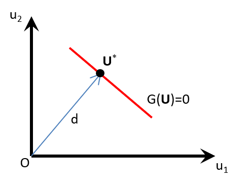

&nbsp;

Despite criticisms and called by different names, Most Probable Point (MPP) is a fascinating concept, arisen from the field of structural reliability. Other names include Most Probable Failure Point, Most Central Limit-state Point, Most Central Failure Point, Design Point. The last one is deemed the most satisfactory. Nevertheless, we call it MPP in this markdown.

In structural reliability, a performance function $G(\mathbf{X})$ characterizes the response of the system: with a negative value indicating failure and a positive value implying that the system is safe. The border between the negative and positive domains is called the limit state: $G(\mathbf{X})=0$. A complete treatment of structural reliability can be found in this book [@Lemaire2009]. Reliability concerns with the probability of not failing, ie. the complement of the probability of failure $P_f$:
\begin{equation*}
\text{Reliability} = 1 - P_f 
\end{equation*}
The most common method to calculate the probability of failure is the Monte Carlo simulation. However, the required number of samples increases drastically when $P_f$ is getting small. MPP provides an approximation to $P_f$, with computation cost that does not depend on the magnitude of $P_f$, because finding MPP is an optimization problem.

Hasofer-Lind [@Hasofer1974] prescribed a procedure to obtain the MPP:

1. Transform all of the input random variables from the physical space into uncorrelated standardized normal random variables.
2. Find the MPP. The distance from the origin to the MPP in the standardized uncorrelated space is called the Hasofer-Lind index $\beta$, also called the reliability index.

With First Order Reliability Method (FORM) approximation of the limit state, the probability of failure $Prob(G(\mathbf{X})<0)$ is given by $\Phi(-\beta)$, where $\Phi$ is the cumulative distribution function (CDF) of the standard normal distribution.

We can get some intuition from a simple case of a linear performance function (and hence a linear limit state) with uncorrelated normally distributed inputs. We will slowly relax out to a more general case.

# Linear performance function
## Uncorrelated normally distributed inputs

Suppose the performance function $G(\mathbf{X})$ is a linear function of the input random variates $\mathbf{X}$,
\begin{equation*}
G(\mathbf{X})=a_0+a_1X_1+\cdots+a_nX_n=a_0+\sum_{i=1}^{n}a_iX_i
\end{equation*}
and suppose that the input random variates are already transformed into uncorrelated normal random variables, then $G(\mathbf{X})$ is also normally distributed.

Let us standardize all $X_i$ into $U_i$:
\begin{equation*}
U_i=(X_i-\mu_i)/\sigma_i
\end{equation*}
where $\mu_i$ and $\sigma_i$ are the mean and standard deviation of each $X_i$.

Then:
\begin{align}
G(\mathbf{U})&=a_0+a_1(\sigma_1U_1+\mu_1)+\cdots+a_n(\sigma_nU_n+\mu_n) \\
&=(a_0+\sum_{i=1}^{n}a_i\mu_i)+a_1\sigma_1U_1+\cdots+a_n\sigma_nU_n \\
&=b_0+\sum_{i=1}^{n}b_iU_i
\end{align}
where
\begin{align}
b_0&=(a_0+\sum_{i=1}^{n}a_i\mu_i) \\
b_i&=a_i\sigma_i
\end{align}

The mean and variance of the normally distributed $G(\mathbf{U})$ are:
\begin{align}
\mu_G&=b_0 \\
\sigma_G^2&=\sum_{i=1}^{n}b_i^2
\end{align}

The probability of failure $P_f$ is exactly: $P_f=Prob(G(\mathbf{X})<0)=Prob(G<0)$.

We can standardize $G$ into $G_U$: $G_U=(G-\mu_G)/\sigma_G$.

\begin{align}
P_f&=Prob(G<0)=Prob(\sigma_G G_U + \mu_G<0) \\
&=Prob(G_U< -\mu_G/\sigma_G) \\
&=\Phi(-\mu_G/\sigma_G) \\
&=\Phi(-\frac{b_0}{\sqrt{\sum_{i=1}^{n}b_i^2}})
\end{align}

The argument inside the $\Phi$ function is the distance from origin to the hyper-plane of the limit state: $G(\mathbf{U})=0$. For reference, see this wikipedia page [@wikiDistancePointPlane].

```{r sketchMPP, fig.cap="A sketch of the MPP point $\\mathbf{U}^{*}$ on the *linear* limit-state hyper-plane", fig.align="center", echo=FALSE}

```

We just saw that in a very restricted case: if the performance function $G(\mathbf{X})$is linear, and therefore the limit state $G(\mathbf{X})=0$ is a hyper-plane, then the probability of failure $P_f$ is given exactly by $\Phi(-\beta)$, where $\beta$ is the distance $d$ from the origin $\mathbf{O}$ to MPP $\mathbf{U}^{*}$ on the hyper-plane of the linear limit-state function $G(\mathbf{U})=0$ in the uncorrelated standardized normally distributed input space [Figure \@ref(fig:sketchMPP)]. Later, in more relaxed cases, $\Phi(-\beta)$ becomes only an approximation to $P_f$.

Since $P_f$ is simply a CDF, which is (approximately) $\Phi(-d)$, and since $d$ is the *length* of the hyper-sphere of the standardized input random variables $\mathbf{U}$, another subtle use case of MPP is that we can find the quantile of the output function $G$ by calculating $G(\mathbf{U}^{*})$. For example, if we want to find the output quantile at 4-sigma (ie. $Q(0.9999683)$), we can find the MPP point $\mathbf{U}^{*}$ on the $G(\mathbf{U})$ hyper-plane that coincides with the hyper-sphere of the standardized input random variables, then the output quantile at 4-sigma is $G(\mathbf{U}^{*})$. The example given in the last section is solving output quantile instead of calculating $P_f$.

## Correlated normally distributed inputs

An n-dimensional correlation matrix $\Sigma$ can be diagonalized: $\Sigma = \mathbf{Q}\Lambda\mathbf{Q}^{-1}$, and therefore the correlated inputs can be linearly transformed to uncorrelated inputs. Since a correlation matrix is always positive (semi)-definite, it can be factorized using Cholesky decomposition: $\Sigma = \mathbf{L}\mathbf{L}^{T}$.

A 2-D example:
\begin{equation*}
\Sigma=\begin{bmatrix}
1 & \rho \\
\rho & 1
\end{bmatrix}
,\hspace{3em}
\mathbf{L}=\begin{bmatrix}
1 & 0 \\
\rho & \sqrt{1-\rho^2}
\end{bmatrix}
\end{equation*}

\begin{equation*}
\Sigma=\begin{bmatrix}
1 & \rho \\
\rho & 1
\end{bmatrix}
=\mathbf{L}\mathbf{L}^{T}=
\begin{bmatrix}
1 & 0 \\
\rho & \sqrt{1-\rho^2}
\end{bmatrix}
\begin{bmatrix}
1 & \rho \\
0 & \sqrt{1-\rho^2}
\end{bmatrix}
=\begin{bmatrix}
1 & \rho \\
\rho & \rho^2+(1-\rho^2)
\end{bmatrix}
\end{equation*}

If $\mathbf{U}=(u_1,u_2)$ are the uncorrelated components, we can get the correlated components $\mathbf{X}=(x_1,x_2)$ by doing a linear transformation: $\mathbf{X}={\mathbf{L}\times\mathbf{U}}$, with $\mathbf{L}$ being the Cholesky decomposition lower triangular matrix:
\begin{align}
x_1&=u_1 \\
x_2&=\rho u_1+\sqrt{1-\rho^2} u_2
\end{align}

Conversely, given the correlated components $\mathbf{X}=(x_1,x_2)$, to get the uncorrelated components $\mathbf{U}=(u_1,u_2)$, we can use the following linear transformation $\mathbf{U}={\mathbf{L}^{-1}\times\mathbf{X}}$:
\begin{align}
u_1&=x_1 \\
u_2&=\frac{-\rho x_1+x_2}{\sqrt{1-\rho^2}}
\end{align}

## Correlated any (either normal or non-normal) distributed inputs

Suppose the means $\mu_{X_i}$ and standard deviations $\sigma_{X_i}$ of the input random variables are known, and the correlation matrix $\rho_{X_i X_j}$ among them is known, and the marginal CDF $F_{X_i}(x_i)$ of each $X_i$ is known, Nataf transformation can be employed to get to the uncorrelated normally distributed input space.

Consider two correlated any (either normal or non-normal) distributed random variables $X_1$ and $X_2$. The marginal CDFs $F_{X_i}(x_i)$ are known. Let $Z_1$ and $Z_2$ are standard normal but correlated, then $X_i$ can be integral-transformed to $Z_i$:
\begin{equation*}
z_1=\Phi^{-1}(F_{X_1}(x_1)), \hspace{3em} z_2=\Phi^{-1}(F_{X_2}(x_2)) (#eq:cdftransform)
\end{equation*}

Nataf transformation assigns a joint PDF to $X_1$ and $X_2$, such that $Z_1$ and $Z_2$ are jointly normal:
\begin{equation}
f_{X_1 X_2}(x_1, x_2) = \phi_2(z_1, z_2, \rho_{0,12})\frac{f_{X_1}(x_1)f_{X_2}(x_2)}{\phi(z_1)\phi(z_2)} (\#eq:jointNataf)
\end{equation}

where $f_{X_i}(x_i) = dF_{X_i}(x_i)/dx_i$ is the marginal PDF of $X_i$, and $\phi_2$ is the bivariate standard normal PDF with correlation coefficient $\rho_{0,12}$. $\rho_{0,12}$ is not known, but it can be related to the known correlation coefficient $\rho_{12}$ between $X_1$ and $X_2$, which by denition is:
\begin{equation}
\rho_{12}=\iint\left(\frac{x_1-\mu_{X_1}}{\sigma_{X_1}}\right) \left(\frac{x_2-\mu_{X_2}}{\sigma_{X_2}}\right) f_{X_1 X_2}(x_1, x_2) dx_1 dx_2 (#eq:rho12)
\end{equation}

Substituting \@ref(eq:jointNataf) into \@ref(eq:rho12), and with $f_{X_i}(x_i)dx_i=\phi(z_i)dz_i$:
\begin{align}
\rho_{12}&=\iint\left(\frac{x_1-\mu_{X_1}}{\sigma_{X_1}}\right) \left(\frac{x_2-\mu_{X_2}}{\sigma_{X_2}}\right) \phi_2(z_1,z_2,\rho_{0,12}) \frac{f_{X_1}(x_1)f_{X_2}(x_2)}{\phi(z_1)\phi(z_2)} dx_1 dx_2 \\
&=\iint\left(\frac{x_1-\mu_{X_1}}{\sigma_{X_1}}\right) \left(\frac{x_2-\mu_{X_2}}{\sigma_{X_2}}\right) \phi_2(z_1,z_2,\rho_{0,12}) dz_1 dz_2 (\#eq:rhoExact) \\
\end{align}

Der Kiureghian and Liu [@Kiureghian1986] provided semi-empirical equations between the correlation coefficients to avoid difficult calculation of  \@ref(eq:rhoExact):
\begin{equation}
F=\frac{\rho_{0,ij}}{\rho_{ij}} (\#eq:rhoDKL)
\end{equation}

One example of the equations that we will use later is:

- when $X_i$ is normal and $X_j$ is lognormal: $F=F(\delta_j)$, where $\delta_j=\sigma_j/\mu_j$:
\begin{equation}
F(\delta_j)=\frac{\delta_j}{\sqrt{\ln(1+\delta_j^2)}} (\#eq:Flognormal)
\end{equation}

Generalization to n-dimensional inputs is straightforward, \@ref(eq:jointNataf) becomes:
\begin{equation*}
f_{X}(\mathbf{x})=\phi_n(\mathbf{z}, \mathbf{R}_0) \frac{f_{X_1}(x_1) f_{X_2}(x_2) \cdots f_{X_n}(x_n)}{\phi(z_1) \phi(z_2) \cdots \phi(z_n)}
\end{equation*}
where $\phi_n(\mathbf{z}, \mathbf{R}_0)$ is n-dimensional standard normal PDF with correlation matrix $\mathbf{R_0}$. The elements of $\mathbf{R_0}$ are obtained either from \@ref(eq:rhoExact) or from semi-empirical equations in [@Kiureghian1986]. Then the step to uncorrelate $Z_i$ is to perform Cholesky decomposition on $\mathbf{R_0}$: $\mathbf{R_0}=\mathbf{L}\mathbf{L}^T$, then $\mathbf{U}=\mathbf{L}^{-1}\times\mathbf{Z}$ is the uncorrelated normally distributed inputs.

# Non-linear performance function

For a non-linear performance function, the limit-state will also definitely be non-linear. Even when the performance function is linear, transformation of input variables in \@ref(eq:cdftransform) can result in non-linear limit-state function. In such cases, one has to resort to FORM (or SORM) approximation of the limit-state. FORM replaces the surface of the limit-state by its hyper-plane tangent at MPP, then $P_f$ is approximated to be: $P_f \approx \Phi(-\beta)$. The curvier the surface, the worse the approximation becomes.

# Finding MPP

Finding MPP is an optimization problem. A popular first order (ie. requiring first derivative) algorithm is Hasofer-Lind-Rackwitz-Fiessler algorithm [@Rackwitz1978]. In the example below, instead of finding $\beta$, we are finding the output quantile at a specified sigma. The crude iterative algorithm in the example simply looks for the MPP point on the fixed hyper-sphere (due to specified sigma), such that the vector of origin $\mathbf{O}$ to MPP $\mathbf{U}^{*}$ is parallel with the gradient at the MPP $\nabla G(\mathbf{U}^{*})$.

# Example

We picked a 2D input example for easy visualization. Consider a non-linear performance function with 2D inputs, one being log-normally distributed and a second one being normally distributed, with a known correlation coefficient among the two: $G(x_1, x_2) = (x_1+x_2)^2+3(-x_1+x_2)^2$, with $X_1 \sim \text{Lognormal}(1.5, 0.5^2)$,  $X_2 \sim \mathcal{N}(7,1.5^2)$, and $\rho_{X_1 X_2}$ = 0.65. Find the $\pm4\sigma$ quantile of $G$ using MPP and verify it with Monte Carlo simulations.

The first step of the Hasofer-Lind procedure is to express $G(x_1, x_2)$ as $G(u_1, u_2)$ with $u_1$, $u_2$ being uncorrelated normally distributed inputs.

1. We starts backward from $U_1 \sim \mathcal{N}(0,1^2)$, and $U_2 \sim \mathcal{N}(0,1^2)$.
2. Correlate $\mathbf{U}$ to get $\mathbf{Z}$, with $\mathbf{Z}$ still being normally distributed  $\mathbf{Z} \sim \mathcal{N}(0,1^2)$, using yet to be determined $\rho_{0, X_1 X_2}$ from \@ref(eq:rhoDKL) :
\begin{align}
z_1&=u_1 \\
z_2&=\rho_{0, X_1 X_2} u_1 + \sqrt{1-\rho_{0, X_1 X_2}^2} u_2
\end{align}
3. Scale and shift $\mathbf{Z}$ to get $\mathbf{V}$, with $V_1 \sim \mathcal{N}(1.5,0.5^2)$, and $V_2 \sim \mathcal{N}(7,1.5^2)$:
\begin{align}
v_1&=0.5 z_1 + 1.5 \\
v_2&=1.5 z_2 + 7
\end{align}
4. Transform normal into lognormal:
\begin{align}
x_1&= \exp(v_1) \\
x_2&= v_2
\end{align}

Given $X_1 \sim \text{Lognormal}(1.5, 0.5^2)$, we can calculate its mean and variance [@wikiLognormal]:
\begin{align}
\mu_{X_1} &= \exp\left(\mu + \frac{\sigma^2}{2}\right) \\
&= \exp (1.5 + 0.5^2/2 ) = 5.078419\\
\sigma_{X_1}^2 &= \left[\exp(\sigma^2)-1\right] \exp(2\mu+\sigma^2) \\
&= \left[\exp(0.5^2)-1\right] \exp(2 \times 1.5 + 0.5^2) = 7.325112
\end{align}

Using \@ref(eq:Flognormal):
\begin{equation*}
\delta_{X_1}=\sigma_{X_1}/\mu_{X_1}=\frac{\sqrt{7.325112}}{5.078419}=0.5329404 \\
F(\delta_{X_1})=\frac{\delta_{X_1}}{\sqrt{\ln(1+\delta_{X_1}^2)}}=\frac{0.5329404}{\sqrt{\ln(1+0.5329404^2)}}=1.065881
\end{equation*}

Then using \@ref(eq:rhoDKL), we can get $\rho_{0, X_1 X_2}$ to be substituted into step 2 above:
\begin{equation*}
\rho_{0, X_1 X_2}=F \times \rho_{X_1 X_2} = 1.065881 \times 0.65 = 0.6928225
\end{equation*}

Following step 1 to 4 outlined above, $G$ becomes:
\begin{align}
G(x_1, x_2)=& (x_1+x_2)^2+3(-x_1+x_2)^2 \\
G(v_1, v_2)=& (\exp(v_1)+v_2)^2+3(-\exp(v_1)+v_2)^2 \\
G(z_1, z_2)=& (\exp(0.5 z_1 + 1.5)+(1.5 z_2 + 7))^2+3(-\exp(0.5 z_1 + 1.5)+(1.5 z_2 + 7))^2 \\
G(u_1, u_2)=& (\exp(0.5 u_1 + 1.5)+(1.5 (0.6928225 u_1 + 0.7211082 u_2) + 7))^2+ \\
& 3(-\exp(0.5 u_1 + 1.5)+(1.5 (0.6928225 u_1 + 0.7211082 u_2) + 7))^2
\end{align}

The second step of the Hasofer-Lind procedure is to find MPP. The following code shows a crude iterative method to find the MPP point on the 4-sigma hyper-sphere of the $(u_1,u_2)$ inputs, such that the vector of origin $\mathbf{O}$ to MPP $\mathbf{U}^{*}$ is parallel (for $+4\sigma$, or anti-parallel for $-4\sigma$) with the gradient at the MPP $\nabla G(\mathbf{U}^{*})$.

We can calculate $\nabla G(u_1, u_2)$ by hand:
\begin{align}
\nabla G(u_1, u_2) =& \hat{u_1} \{ 2 [\exp (0.5u_1+1.5) + 1.5(\rho_0 u_1 + \sqrt{1-\rho_0^2} u_2) + 7] \times [0.5 \exp (0.5u_1+1.5) + 1.5 \rho_0]  + \\
& 6 [-\exp (0.5u_1+1.5) + 1.5(\rho_0 u_1 + \sqrt{1-\rho_0^2} u_2) + 7] \times [-0.5 \exp (0.5u_1+1.5) + 1.5 \rho_0] \} + \\
& \hat{u_2} \{  2 [\exp (0.5u_1+1.5) + 1.5(\rho_0 u_1 + \sqrt{1-\rho_0^2} u_2) + 7] \times [1.5 \sqrt{1-\rho_0^2} ]  + \\
& 6 [-\exp (0.5u_1+1.5) + 1.5(\rho_0 u_1 + \sqrt{1-\rho_0^2} u_2) + 7] \times [1.5 \sqrt{1-\rho_0^2} ] \}
\end{align}

Let us calculate $\rho_0$ for the log-normal $X_1$ variable:
```{r calculate-rho0-for-lognormal}
#lognormal:  m1=1.5, s1=0.5
m1= 1.5; s1= 0.5

m_x1= exp(m1 + 0.5*s1^2)
var_x1= (exp(s1^2)-1)*exp(2*m1+s1^2)
delta_x1= sqrt(var_x1)/m_x1
f_x1= delta_x1/sqrt(log(1+delta_x1^2))

rho= 0.65
rho_0= f_x1* rho
print (rho_0)
```

We will setup the functions to calculate $G(\mathbf{U})$ and $\nabla G(\mathbf{U})$.
```{r setup-g-and-grad-g}
# calculate L2-norm
f_norm <- function(x) {
  return ( ((x %*% x)[1, 1])^0.5 )
}
# g
f_g <- function(u) {
  u1= u[1]
  u2= u[2]
  return ( (exp(0.5*u1+1.5) + (1.5*(rho_0*u1+sqrt(1-rho_0^2)*u2)+7))^2 + 3*(-exp(0.5*u1+1.5) + (1.5*(rho_0*u1+sqrt(1-rho_0^2)*u2)+7))^2 )
}
# dg returns the u1 and u2 components of the gradient g
f_dg <- function(u) {
  u1= u[1]
  u2= u[2]
  return (c(
    (2*(exp(0.5*u1+1.5) + (1.5*(rho_0*u1+sqrt(1-rho_0^2)*u2)+7))*(0.5*exp(0.5*u1+1.5)+1.5*rho_0) + 6*(-exp(0.5*u1+1.5) + (1.5*(rho_0*u1+sqrt(1-rho_0^2)*u2)+7))*(-0.5*exp(0.5*u1+1.5)+1.5*rho_0)) ,
    (2*(exp(0.5*u1+1.5) + (1.5*(rho_0*u1+sqrt(1-rho_0^2)*u2)+7))*(1.5*sqrt(1-rho_0^2)) + 6*(-exp(0.5*u1+1.5) + (1.5*(rho_0*u1+sqrt(1-rho_0^2)*u2)+7))*(1.5*sqrt(1-rho_0^2)) )) )
}
```

Finding $+4\sigma$ MPP point:
```{r finding-positive-4-sigma}
r= 4
# u1 and u2 are initial guess of points along the 4sigma circle
u1= 4
u2= 0
u_ = c(u1,u2)
for (i in 1:10) {

  g= f_g(u_)
  dg_ = f_dg(u_)
  
  dot= ((u_/r) %*% (dg_/f_norm(dg_) ) )[1,1]
  print (c(u_, g, dot))
  
  #un are new points
  #There are two MPP i.e. at +/-4sigma, we run this algorithm at +/- the gradient
  #un = u_/r +/- dg_/f_norm(dg_)
  un = u_/r + dg_/f_norm(dg_)
  u_ = un/f_norm(un) * r
}

```

From the code chunk above, the MPP point for $+4\sigma$ is $\mathbf{U}^{*}=(u_1, u_2) = (3.99965853, -0.05226496)$, and $G(\mathbf{U}^{*})= 3407.79793224$.

Finding $-4\sigma$ MPP point:
```{r finding-negative-4-sigma}
r= 4
# u1 and u2 are initial guess of points along the 4sigma circle
u1= 4
u2= 0
u_ = c(u1,u2)
for (i in 1:10) {

  g= f_g(u_)
  dg_ = f_dg(u_)
  
  dot= ((u_/r) %*% (dg_/f_norm(dg_) ) )[1,1]
  print (c(u_, g, dot))
  
  #un are new points
  #There are two MPP i.e. at +/-4sigma, we run this algorithm at +/- the gradient
  #un = u_/r +/- dg_/f_norm(dg_)
  un = u_/r - dg_/f_norm(dg_)
  u_ = un/f_norm(un) * r
}

```

From the code chunk above, the MPP point for $-4\sigma$ is $\mathbf{U}^{*}=(u_1, u_2) = (-3.134196, -2.485320)$, and $G(\mathbf{U}^{*})= 4.001575$.

To recap the $\pm 4 \sigma$ points for $G$, approximated by the MPP method are: 4.001575 and 3407.79793224.

Let us now turn to Monte-Carlo simulation (MCS) to verify them. 

We pick the number of samples = $3 \times 10^7$ to have enough points to calculate the $\pm 4 \sigma$ quantiles. And follow the transformation of variables in step 1-4 of Hasofer-Lind procedure outlined before. Please be aware that the results may change when you re-run the code chunk

```{r MCS-setup}
# number of samples
N= 3e7
# u-space: standardized, uncorrelated
u1= rnorm(N)
u2= rnorm(N)

#lognormal:  m1=1.5, s1=0.5
#normal: m2=7, s2=1.5
m1= 1.5; s1= 0.5
m2= 7; s2= 1.5

m_x1= exp(m1 + 0.5*s1^2)
var_x1= (exp(s1^2)-1)*exp(2*m1+s1^2)
delta_x1= sqrt(var_x1)/m_x1
f_x1= delta_x1/sqrt(log(1+delta_x1^2))

rho= 0.65
rho_0= f_x1* rho

#z-space: standardize, correlated
z1= u1
z2= rho_0 * u1 + sqrt(1-rho_0^2) * u2

#v-space: scaled and shifted
v1= s1*z1 + m1
v2= s2*z2 + m2

#x-space:
x1= exp(v1)
x2= v2

```

Let us verify that we have $X_1 \sim \text{Lognormal}(1.5, 0.5^2)$,  $X_2 \sim \mathcal{N}(7,1.5^2)$, and $\rho_{X_1 X_2}$ = 0.65 after the variable transformations.

We are plotting the histogram of $X_1$ and $X_2$ below, overlaid with the corresponding distributions (red curve), ie: $X_1 \sim \text{Lognormal}(1.5, 0.5^2)$,  $X_2 \sim \mathcal{N}(7,1.5^2)$:

```{r library}
library(ggplot2)
library(ggpubr)
```

```{r histogram-X1-X2}
plothistx1 <- ggplot(data= data.frame(X1 = x1)) +
  geom_histogram(mapping=aes(x=X1, y=..density..), fill="steelblue", color="black", bins=50) +
  stat_function(fun=dlnorm, args=list(mean=m1, sd=s1), color="red", size=1) +
  xlim(0, 20)
plothistx2 <- ggplot(data= data.frame(X2 = x2)) +
  geom_histogram(mapping=aes(x=X2, y=..density..), fill="steelblue", colour="black", bins=50) +
  stat_function(fun=dnorm, args=list(mean=m2, sd=s2), color="red", size=1) +
  xlim(m2-6*s2, m2+6*s2)
ggarrange(plothistx1, plothistx2, ncol=2, nrow=1, labels=c("X1", "X2"))
```

Let us verify that $\rho_{X_1 X_2} \approx 0.65$:
```{r rho_x1_x2}
cor(x1,x2)
```

Let us calculate the quantiles:
```{r MCS-4-sigma-quantiles}
# calculate g(x)
g= (x1+x2)^2 + 3*(-x1+x2)^2
quantile(g, pnorm(-4))
quantile(g, pnorm(4))

```

I am getting $-4 \sigma$ quantile of $G$ to be 4.631767, and $+4 \sigma$ quantile of $G$ to be 3402.384 in one of the runs. And of course the results may change as you re-run the code chunk. 

```{r qqplot}
gdf= data.frame(G=g)
qqall <- ggplot(data= gdf, aes(sample=G)) + stat_qq() + stat_qq_line(color="red")
qqn4 <- ggplot(data= gdf, aes(sample=G)) + stat_qq() + stat_qq_line() + xlim(-4.1, -3.9) + ylim(3.5, 5)
qqp4 <- ggplot(data= gdf, aes(sample=G)) + stat_qq() + stat_qq_line() + xlim(3.9, 4.1) + ylim(3300, 3500)
ggarrange(qqall, qqn4, qqp4, ncol=3, nrow=1)
```

Notice that the $+4 \sigma$ approximated from MPP is relatively close to that from (ideal) MCS, whereas the $-4 \sigma$ from MPP approximation is not that accurate. We will see why now.

```{r contour}
# contour
zxy = expand.grid(seq(-6,6,0.1),seq(-6,6,0.1))
g = matrix( (exp(s1*zxy$Var1+m1)+(s2*rho_0*zxy$Var1+s2*sqrt(1-rho_0^2)*zxy$Var2+m2))^2 + 3*(- exp(s1*zxy$Var1+m1) + (s2*rho_0*zxy$Var1+s2*sqrt(1-rho_0^2)*zxy$Var2+m2))^2 , length(seq(-6,6,0.1)), length(seq(-6,6,0.1)) )
contour(seq(-6,6,0.1),seq(-6,6,0.1),g, levels=c(2, 4.001575, 30, 100, 300, 1000, 3407.79793777, 5000), asp=1, xlim=c(-6,6), ylim=c(-6,6))
# plotting the 4 sigma circle
r= 4
t= seq(-pi,pi,2*pi/360)
xr= r*cos(t)
yr= r*sin(t)
lines(xr, yr, col= "red")
# MPP points
points(c(-3.134196, 3.99965853),c(-2.485320, -0.05226496), pch=19, col="blue")
abline(v=seq(-6,6), h=seq(-6,6), lty=2, col='lightgray')
```

From the contour plot above, and since this is a simple 2-D input example, we can tell that the contour (ie. state-limit) at $+4\sigma$ point (G=3407.798) is closer to a linear hyper-plane, whereas the contour $-4\sigma$ point (G=4.001575) is way curvier and won't be approximated well by a linear hyper-plane.

In summary, we illustrated Hasofer-Lind MPP procedure can be used to approximate the output quantile, as long as the limit-state can be approximated by a hyper-plane.

# References
